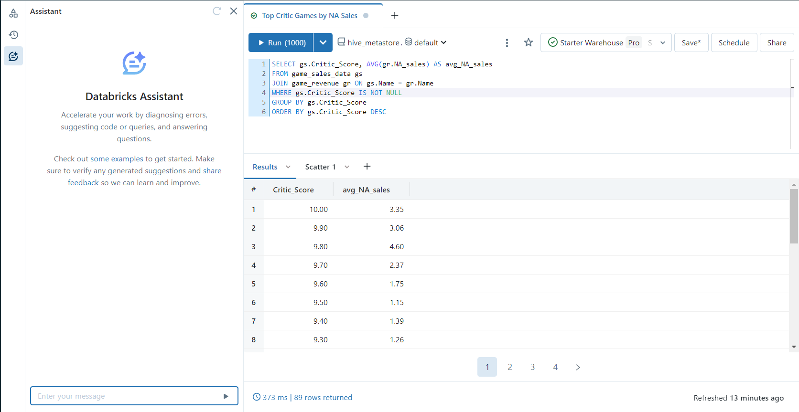
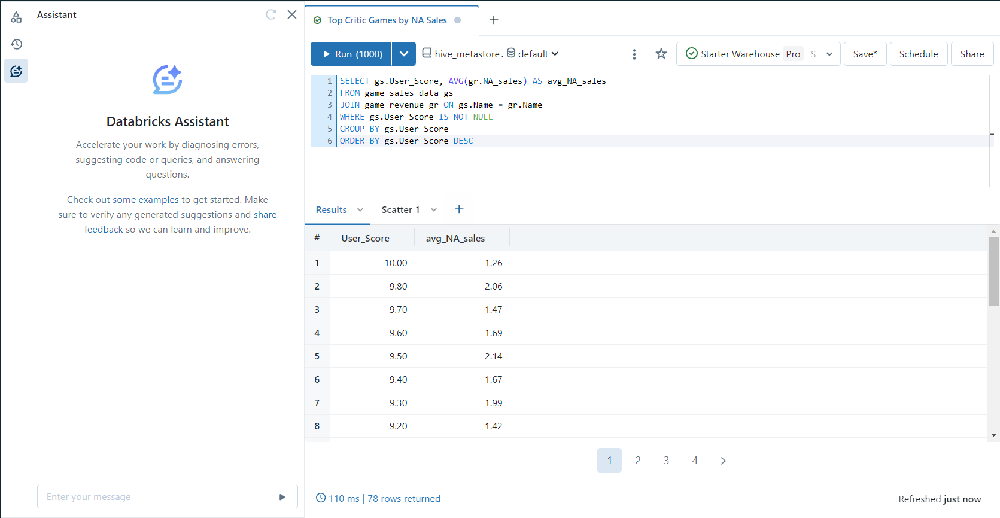

## Azure Databricks Demo
This projects utilizes data hosted on Azure Databricks and the built in SQL editor to perform powerful analysis of multiple data tables within a database. In this demonstration I have imported two datasets from Kaggle which cover video game revenue and video game rankings. These csv files are located within this repository for reference. I then used the Azure SQL editor to perform some analysis of this data through complex queries assisted by Azure's built in generative AI. This was to get an intuition on how to use these tools and assess how good the functionality of these Azure services were. Moreover, this project gave me better intuition for how SQL queries can be used at scale to answer complex questions:

The question I wanted to answer going into this project was the relationship between User Scoring and Critic Scoring for Video Games. Specifically, which was a better predictor of game quality. In this example I used North American sales as a proxy for game quality. The entry assumption here is that a poorly reviewed game will do poorly in the market as directly related to the actual quality of the game itself. As someone who plays video games, I find myself trusting user scores more often than not. In my mind, I have an inherent suspicion of Video Game Critics because I feel that industry has monetized the review process and so there is an element of bias where the individual user is, on average, giving their most genuine assesment of the product. To that end, I expected user score to be a better predictor of sales revenue. I also expected there to be deviant games which had a high user score and low critic score that ended up doing well in sales. These products for which the fan base may be fiercly dedicated to the intellectual property or have ammassed a 'cult following' of sorts. Below are some screenshots of the Azure UI and the queries used to assess this question:

First is the Azure UI with build in generative AI assistant:

To answer this question I selected Critic_Score from the game_sales_data (aliased as gs) joined with the revenue table (aliased as gr) to compute average sales. Because I was interested only in the effect of a score against sales, I grouped by User_Score and ensured that Null values were not included. I then took the average of the North American Sales for all games who recieved this score. I subsequently ordered in descending order so I would see the highest scored games in the resulting output. Azure also has built in visualizations which made assessing these trends very easy:
.png>)

I then conducted the same query but for User_Score:

and similarly plotted the results:

What I found was that Critic_Score was a very well defined predictor for average sales in North America and User Score was still correlated but often unreliable. Moreover, Critic Scores have an exponential effect on average sales. It was very interesting to see how strong the critic score trend was for sales. It was also a great demonstration of the power of both SQL queries and the Azure toolbox for using these. 

This data set is actually pretty small but because it is hosted on Azure Databricks, this type of succinct and powerful data analysis can be done at scale through a browser interface. 

### Key Takeaways:
One thing that stood out to me during this project was the need to really understand the data one is working with and likely pair that with domain knowledge. SQL is a very useful tool, and generative AI assistants incredibly helpful, but a user has to know what they want done going in to a problem. I had a very specific series of tasks I wanted accomplished in my head before prompting the assitant and this led to very quick and insightful results. 
